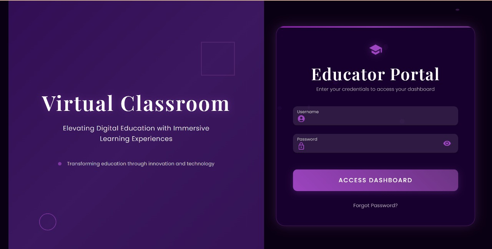
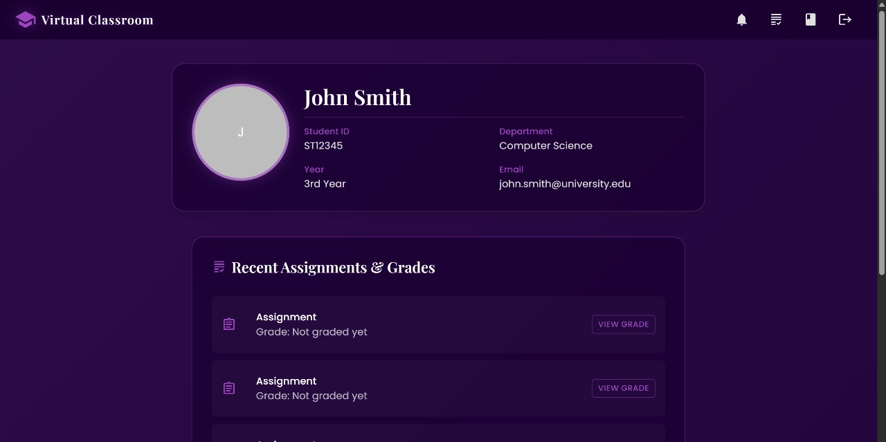
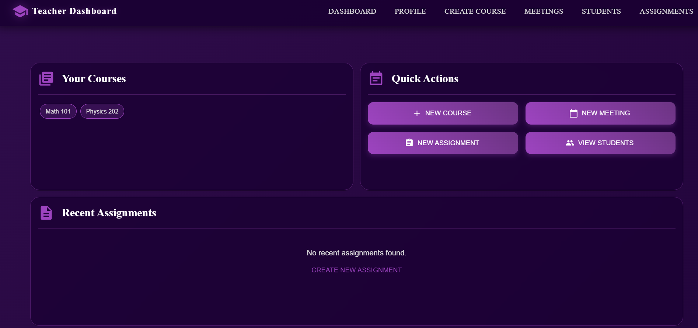
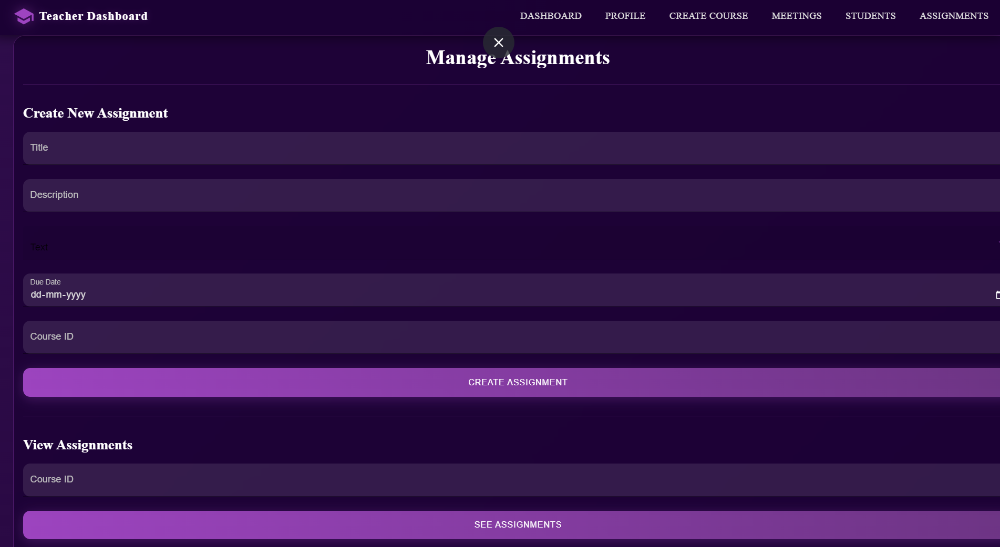
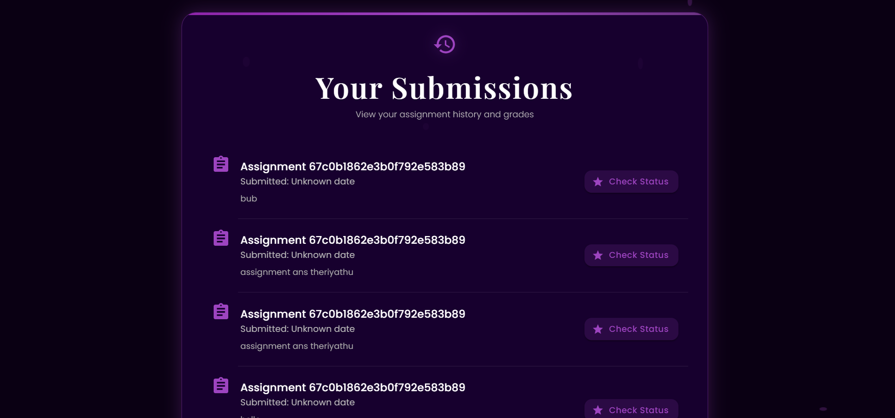
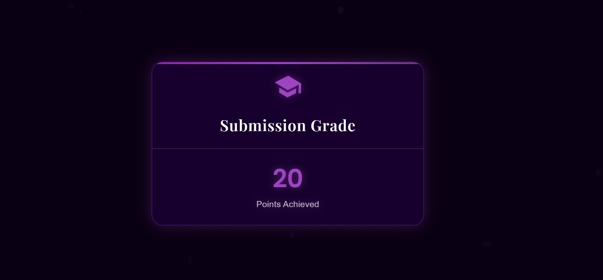
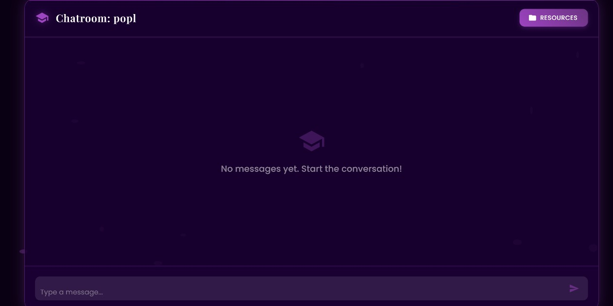
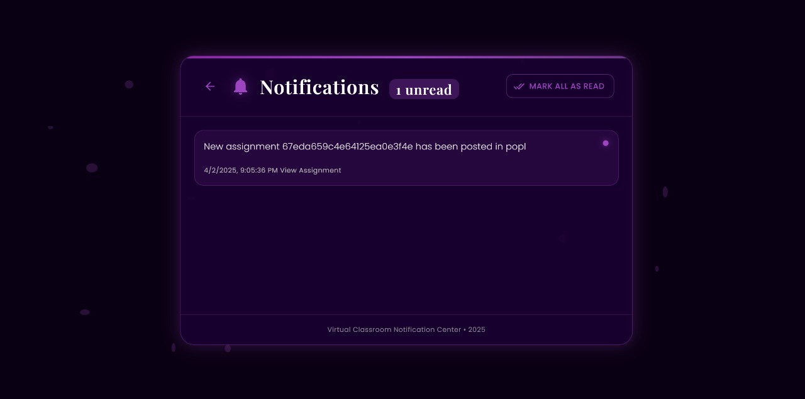
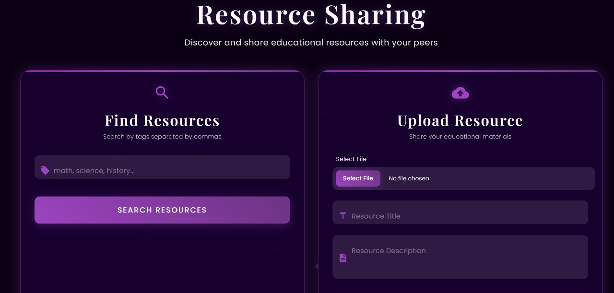
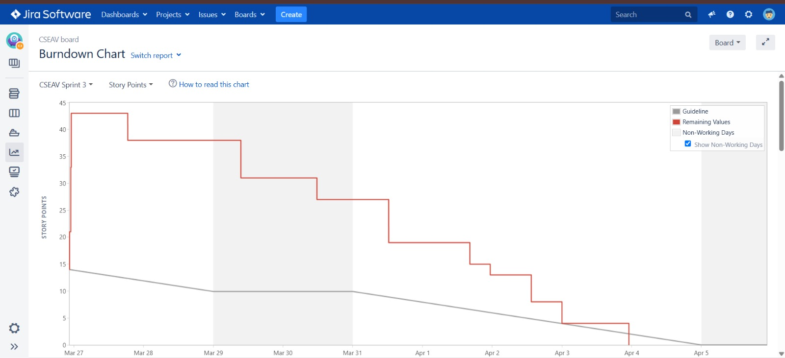

# Virtual Classroom

A comprehensive virtual classroom application with a FastAPI backend and React frontend, providing an interactive online learning environment.

## Features

- Interactive classroom UI
- Real-time chatrooms
- Notifications
- Course Creation and Registration
- Jwt token based session management
- Assignment creation, submission, grading
- Real-time attendance tracking
- Integrated video conferencing
- Resource sharing with AI based tag generation
- Video Conferencing - Gmeet

## Technology Stack

### Backend
- Python - FastAPI
- MongoDB – Database for storing user data, assignments, attendance, and resources.
- Redis– For real-time chat, notifications.
###### Authentication & Security:
- JWT (JSON Web Token) – For user authentication and session management.
- bcrypt.js – For password hashing.
###### Additional Technologies:
- keybert - automatic tagging

### Frontend
- React
- Vite

## Screenshots

## 🔍 Feature Gallery

| Screenshot | Description |
|-----------|-------------|
|  | **Login Page** – Secure authentication interface |
|  | **Student Dashboard** – Personalized view of courses and tasks |
|  | **Teacher Dashboard** – Overview of classes and submissions |
|  | **Assignments Panel** – Assign work and track deadlines |
|  | **Submissions** – View and upload coursework |
|  | **Marks Management** – Grade overview interface |
|  | **Chatroom** – Real-time discussion between users |
|  | **Notifications** – Instant alerts for updates |
|  | **Resource Sharing** – Upload and access materials |
|  | **JIRA Chart** – Sprint progress overview |


## Getting Started

### Prerequisites

- Python 3.7+
- Node.js 14+
- Redis server

### Backend Setup

1. **Clone the repository**
   ```bash
   git clone https://github.com/GuhaneshT/Virtual-classroom---A1.git
   cd Virtual-classroom---A1/backend
   ```

2. **Create a virtual environment**
   ```bash
   python -m venv venv
   source venv/bin/activate  # On Windows use `venv\Scripts\activate`
   ```

3. **Install dependencies**
   ```bash
   pip install -r requirements.txt
   ```

4. **Start Redis server**
   Ensure Redis is installed and running:
   ```bash
   redis-server
   ```

5. **Run the FastAPI application**
   ```bash
   uvicorn main:app --host 0.0.0.0 --port 8000
   ```
   The API will be available at http://localhost:8000

### Frontend Setup

1. **Navigate to the frontend directory**
   ```bash
   cd ../frontend
   ```

2. **Install dependencies**
   ```bash
   npm install
   ```

3. **Start the development server**
   ```bash
   npm run dev
   ```
   The frontend will typically be accessible at http://localhost:3000

## API Documentation

When the backend server is running, API documentation is available at:
- Swagger UI: http://localhost:8000/docs
- ReDoc: http://localhost:8000/redoc
